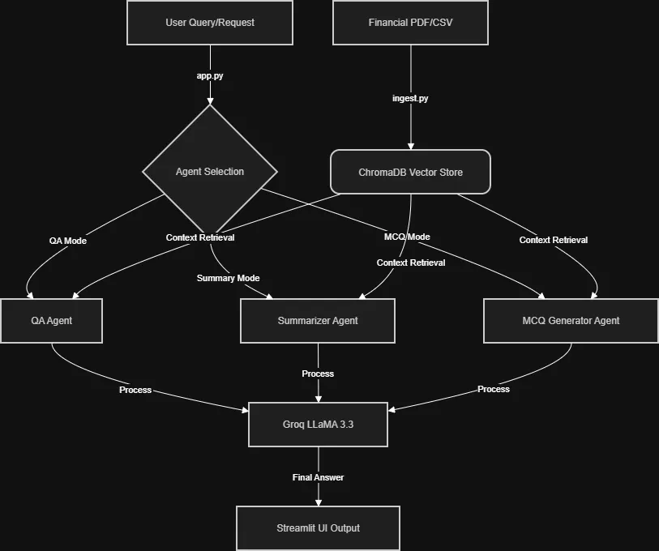
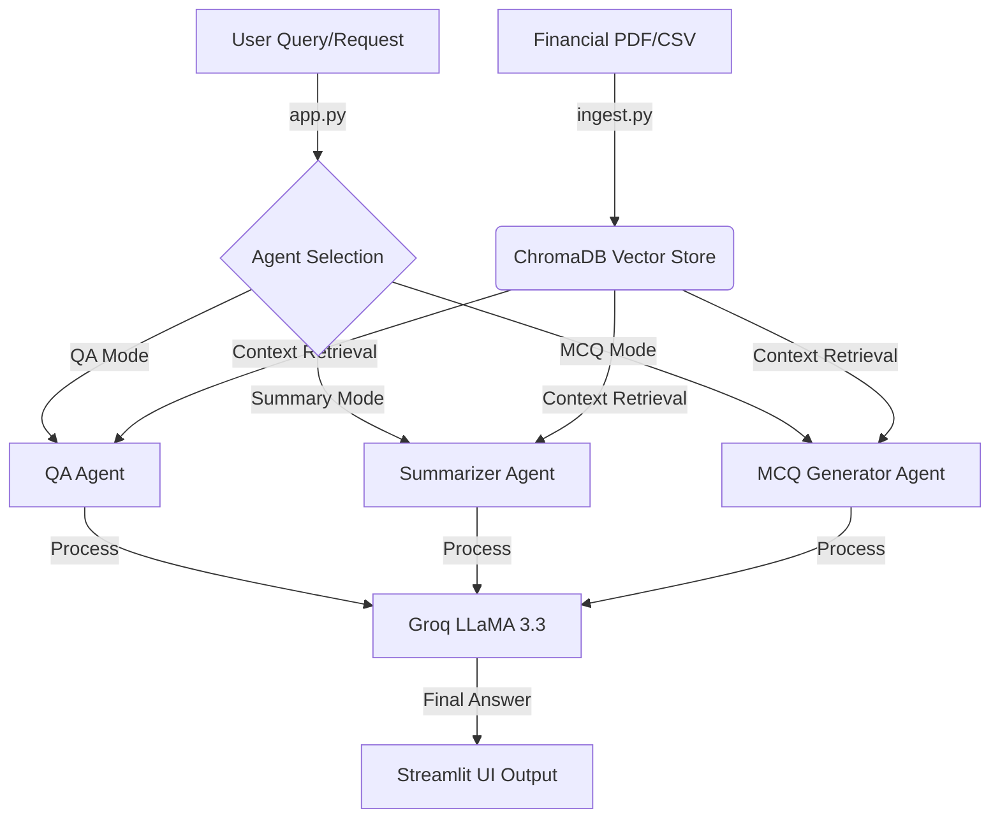

# DocuAgent: Financial AI Assistant

DocuAgent is a sophisticated AI-powered application designed to process, analyze, and interact with complex financial documents. It leverages Retrieval-Augmented Generation (RAG) and a Multi-Agent system to provide highly accurate answers, executive summaries, and educational materials (MCQs) from financial reports.

##  Objective
The primary goal is to transform static, complex financial PDFs and CSVs into an interactive knowledge base. By using specialized agents, the system can understand context better than a simple chatbot, ensuring that financial data is interpreted correctly and presented clearly.

---

##  Core File Structure
```text
DocuAgent/
├── data/                   # Source documents (PDFs, CSVs)
├── chroma_db/              # Persistent Vector Database (generated)
├── day1_basics/            # Foundational scripts
│   ├── preprocess.py       # Text cleaning and extraction logic
│   └── prompt_engineering.py# Prompt templates and LLM configurations
├── day2_rag/               # RAG Pipeline
│   ├── ingest.py           # Document processing and vector storage
│   └── query.py            # Retrieval testing script
├── day3_agents/            # Multi-Agent System
│   ├── app.py              # Streamlit Web Dashboard
│   ├── agents.py           # CrewAI Agent definitions
│   └── tasks.py            # CrewAI Task definitions
├── manage.py               # Universal Project Manager (Cross-platform)
├── requirements.txt        # Project dependencies
└── .env                    # API Keys (e.g., GROQ_API_KEY)
```

---

##  Modules & Functionality

| Module | File | Description |
| :--- | :--- | :--- |
| **Ingestion** | `day2_rag/ingest.py` | Loads PDFs/CSVs, chunks text with overlap, generates embeddings via HuggingFace, and stores them in ChromaDB. |
| **Agents** | `day3_agents/agents.py` | Defines specialized CrewAI agents (QA Specialist, Summarizer, MCQ Generator) with specific roles and backstories. |
| **Tasks** | `day3_agents/tasks.py` | Configures the specific goals and expected outputs for each agent, linking them to retrieved context. |
| **UI** | `day3_agents/app.py` | A modern Streamlit interface that allows users to switch between agent modes and interact with the data. |
| **Manager** | `manage.py` | A single entry point to setup, ingest data, and run the app on both Windows and Mac. |

---

##  Application Flow


*Note: If the image above is not showing, you can view the live logic below:*



---

##  Getting Started

### 1. Prerequisites
- Python 3.10+
- `uv` (recommended) or `pip`

### 2. Installation
Clone the repository and run the setup command to install all necessary dependencies:
```bash
python manage.py setup
```

### 3. Configuration
Create a `.env` file in the root directory and add your Groq API Key:
```text
GROQ_API_KEY=your_groq_api_key_here
```

### 4. Run Ingestion
Place your financial documents in `data/pdfs/` or `data/csvs/`, then run:
```bash
python manage.py ingest
```

### 5. Launch the App
Start the Streamlit dashboard:
```bash
python manage.py run
```
The app will be available at `http://localhost:8501`.

---

##  Tech Stack
- **LLM:** Groq (LLaMA 3.3 70B)
- **Framework:** CrewAI (Multi-Agent Orchestration)
- **Vector DB:** ChromaDB
- **Embeddings:** HuggingFace (all-MiniLM-L6-v2)
- **UI:** Streamlit
- **PDF Engine:** PyMuPDF (fitz)
